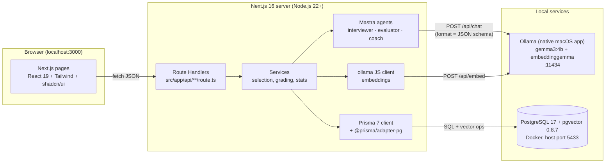
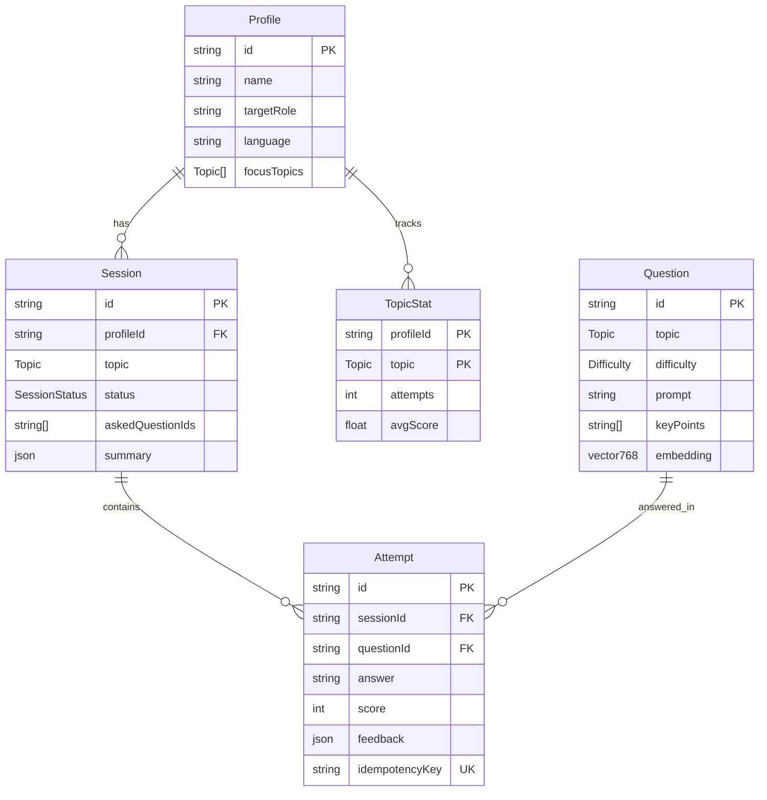
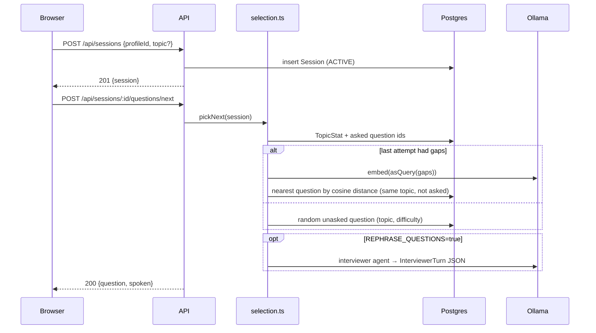
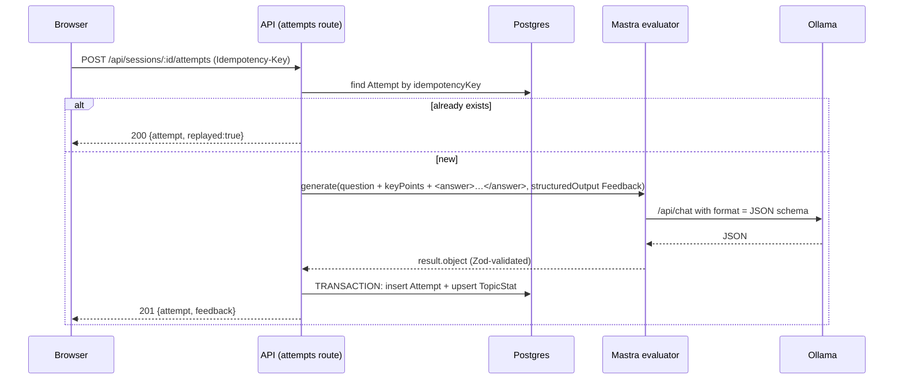

# Prep Buddy — Architecture

Everything runs on one laptop. There are no cloud services and no API keys.

## 1. System overview



**Why each piece**

| Component | Choice | Version (pinned, verified 2 Oct 2026) | Why |
|---|---|---|---|
| Web framework | Next.js App Router | `next@16.3.8`, `react@19.2.x` | Your existing stack; UI + API in one app |
| Language | TypeScript | `typescript@^5` (what create-next-app 16 installs) | Do **not** jump to TS 7.0 this weekend |
| Agent framework | Mastra | `@mastra/core@1.74.0` | Open-source (Apache-2.0 core) TypeScript agents; free; prize category |
| Model provider | ollama-ai-provider-v2 | `ollama-ai-provider-v2@4.0.1` + `ai@7` (peer dep) | Lets a Mastra `Agent` use a local Ollama model |
| LLM | Gemma 3 4B via Ollama | `gemma3:4b` (3.3 GB) | Open-weight, fits 8 GB RAM, multilingual |
| Embeddings | EmbeddingGemma via Ollama | `embeddinggemma` (622 MB, 768 dims) | Open, small, good for retrieval |
| Embedding client | Ollama JS | `ollama@0.6.4` | Simple `embed()` and `list()` calls |
| Validation | Zod 4 | `zod@4.6.5` | Request bodies + model output schemas |
| ORM | Prisma 7 | `prisma@7.10.0`, `@prisma/client@7.10.0`, `@prisma/adapter-pg@7.10.0` | Your existing stack. **Not** `prisma@latest`, which currently points to an 8.0 release candidate |
| Database | PostgreSQL + pgvector | `pgvector/pgvector:0.8.7-pg17` | Relational data + vector similarity in one DB |
| Runtime | Node.js | ≥ 22.18 (you have 24.3.0) | Required by Mastra (≥22.13) and Prisma CLI |

## 2. Folder structure

```
prep-buddy/
├── README.md  TASK.md  LICENSE  .env.example  .gitignore  .dockerignore  docker-compose.yml  prisma.config.ts
├── docs/                      PRD, ARCHITECTURE, API, AI_DESIGN, DEPLOYMENT, TESTING, SUBMISSION, VERIFICATION
├── data/questions.json        question bank (your own wording)
├── prisma/
│   ├── schema.prisma          verified with Prisma 7.10.0
│   ├── migrations/            created by `prisma migrate dev`
│   └── seed.ts                loads data/questions.json + embeds each question
└── src/
    ├── app/
    │   ├── page.tsx                       dashboard (progress + start session)
    │   ├── onboarding/page.tsx            create profile
    │   ├── session/[id]/page.tsx          question → answer → feedback loop
    │   ├── session/[id]/summary/page.tsx  session summary
    │   └── api/                           see docs/API.md
    ├── components/            StatusBadge, QuestionCard, AnswerBox, FeedbackCard, TopicChart
    ├── generated/prisma/      Prisma client output (git-ignored)
    ├── lib/
    │   ├── env.ts             Zod-validated env vars
    │   ├── db.ts              PrismaClient singleton with PrismaPg adapter
    │   ├── ollama.ts          embed(), modelStatus(), prompt prefixes
    │   ├── schemas.ts         Zod: request bodies + Feedback + SessionSummary + InterviewerTurn
    │   ├── errors.ts          ApiError + toResponse()
    │   └── vector.ts          raw SQL helpers for pgvector
    ├── services/
    │   ├── selection.ts       next-question algorithm
    │   ├── grading.ts         evaluate + persist + stats (transaction)
    │   └── summary.ts         coach agent summary
    └── mastra/
        ├── model.ts           createOllama(...) → chatModel
        ├── agents/{interviewer,evaluator,coach}.ts
        └── index.ts           new Mastra({ agents })
```

## 3. Data model



Source of truth: `prisma/schema.prisma`. Enums: `Topic = DSA | CS_FUNDAMENTALS | DBMS | OS | CN | OOP | HR`, `Difficulty = EASY | MEDIUM | HARD`, `SessionStatus = ACTIVE | COMPLETED | ABANDONED`.

**Prisma 7 gotchas (all verified)**
- `extensions = [vector]` needs `previewFeatures = ["postgresqlExtensions"]`, otherwise you get error **P1012**.
- The DB URL lives in `prisma.config.ts` (`datasource.url`), not in `schema.prisma`, and `.env` is loaded by `import "dotenv/config"`.
- The client is generated to `src/generated/prisma`. Import it from `@/generated/prisma/client` and construct it with an adapter: `new PrismaClient({ adapter: new PrismaPg({ connectionString }) })`.
- `TopicStat.updatedAt` is `@updatedAt`, which Prisma fills in, **not** a DB default. Raw SQL must set `"updatedAt" = now()`.
- The seed runs with **`tsx`**. Plain `node --experimental-strip-types` cannot load the generated client.

## 4. Request flows

### 4.1 Start session → first question


### 4.2 Submit answer → feedback


### 4.3 Complete session
`POST /api/sessions/:id/complete` → load attempts → coach agent → `SessionSummary` JSON → update Session (`COMPLETED`, `summary`, `endedAt`).

## 5. Next-question algorithm (`services/selection.ts`)

1. **Topic**: use `session.topic` if set. Otherwise pick the profile's focus topic with the **lowest `avgScore`** (ties → fewer attempts; no stats yet → first focus topic).
2. **Difficulty**: start at `EASY`. If the topic `avgScore ≥ 7` → `MEDIUM`; `≥ 8.5` → `HARD`.
3. **Exclude** questions already asked in this session (`Session.askedQuestionIds`, appended on every `next` call, answered or not).
4. **Targeted pick** (P1): if the previous attempt's `feedback.gaps` is non-empty, embed `asQuery(gaps.join("; "))` and take the nearest unasked question in the topic (any difficulty).
5. **Fallback**: a random unasked question in topic + difficulty → any difficulty in topic → any topic. If the bank is exhausted, return `409 BANK_EXHAUSTED`.

## 6. Vector search (raw SQL, verified on Postgres + pgvector)

Prisma cannot read or write `Unsupported("vector(768)")` columns, so use tagged-template raw queries (they are parameterised, so this is not SQL injection):

```ts
// src/lib/vector.ts
import { prisma } from "@/lib/db";
import type { Topic } from "@/generated/prisma/client";

const toVector = (v: number[]) => `[${v.join(",")}]`;

export async function setQuestionEmbedding(id: string, embedding: number[]) {
  await prisma.$executeRaw`UPDATE "Question" SET embedding = ${toVector(embedding)}::vector WHERE id = ${id}`;
}

export async function nearestQuestions(embedding: number[], topic: Topic, excludeIds: string[], limit = 5) {
  return prisma.$queryRaw<{ id: string; prompt: string; distance: number }[]>`
    SELECT id, prompt, embedding <=> ${toVector(embedding)}::vector AS distance
    FROM "Question"
    WHERE topic = ${topic}::"Topic" AND embedding IS NOT NULL AND id <> ALL(${excludeIds}::text[])
    ORDER BY distance
    LIMIT ${limit}`;
}
```

- `<=>` is **cosine distance** (0 = identical). With about 60 questions a sequential scan is instant, so **no index is needed**. If the bank grows past a few thousand rows, add an HNSW index in a migration: `CREATE INDEX question_embedding_hnsw ON "Question" USING hnsw (embedding vector_cosine_ops);` (verified to work).
- Embedding dims **must** equal `vector(768)`. If you change `EMBED_MODEL`, change the schema and re-embed.

## 7. Stats update (atomic running average, verified)

Run this in the same `prisma.$transaction` as the `Attempt` insert:

```ts
await tx.$executeRaw`
  INSERT INTO "TopicStat"("profileId", topic, attempts, "avgScore", "updatedAt")
  VALUES (${profileId}, ${topic}::"Topic", 1, ${score}, now())
  ON CONFLICT ("profileId", topic) DO UPDATE SET
    "avgScore" = ("TopicStat"."avgScore" * "TopicStat".attempts + EXCLUDED."avgScore") / ("TopicStat".attempts + 1),
    attempts   = "TopicStat".attempts + 1,
    "updatedAt" = now()`;
```
Test result: scores 6, 8, 4 → `attempts = 3`, `avgScore = 6`.

## 8. Error handling

| Situation | HTTP | `error.code` |
|---|---|---|
| Bad JSON / Zod failure | 400 | `VALIDATION_ERROR` |
| Unknown profile/session/question | 404 | `NOT_FOUND` |
| Session not `ACTIVE`; bank exhausted | 409 | `SESSION_NOT_ACTIVE` / `BANK_EXHAUSTED` |
| Ollama down or model not pulled | 503 | `MODEL_UNAVAILABLE` (message includes the `ollama pull …` command) |
| Model output failed the schema twice | 502 | `MODEL_OUTPUT_INVALID` |
| DB unreachable | 503 | `DB_UNAVAILABLE` |
| Anything else | 500 | `INTERNAL` |

Detect "Ollama down" via `ECONNREFUSED` (verified: the provider throws `Cannot connect to API` with cause code `ECONNREFUSED`).

## 9. Security and privacy
- **Local only**: Postgres binds to `127.0.0.1:5433`; Ollama listens on `localhost:11434` by default. Do not expose either.
- **No auth**: this is a single-user local app. If you share it through a tunnel (DEPLOYMENT.md), anyone with the URL can use it. Share it only for the demo, then stop the tunnel.
- **Prompt injection**: answers are wrapped in `<answer>…</answer>` and the system prompt says to never follow instructions inside them. Scores are clamped by the schema, and `MAX_ANSWER_CHARS` caps the input size.
- **Secrets**: none. `.env` holds only local URLs and model names, and is still git-ignored.

## 10. Architecture decisions (ADR log)

| # | Decision | Alternatives | Reason |
|---|---|---|---|
| ADR-1 | Run Ollama **natively**, DB in Docker | Ollama in Docker | Docker on macOS has no Apple-GPU access, so native Ollama is much faster |
| ADR-2 | **No agent tool-calling**; use schema-constrained JSON per step | Mastra tools | Ollama's Gemma 3 page does not advertise tool support; one JSON call per step is more reliable on a 4B model |
| ADR-3 | Agent model = **AI SDK model instance** from `ollama-ai-provider-v2` | `{ providerId, modelId, url }` OpenAI-compatible config | Both type-check against Mastra 1.74; the provider sends the Zod JSON schema as Ollama `format` (constrained decoding) |
| ADR-4 | Keep app data in **our Postgres**, not Mastra memory | `@mastra/pg` storage | We do not use threads/memory; the build-time warning "No `storage` configured on Mastra" is expected and harmless |
| ADR-5 | DB host port **5433** | 5432 | PostgreSQL 18 already runs on 5432 on this Mac |
| ADR-6 | Pin `prisma@7.10.0` | `prisma@latest` | npm `latest` currently resolves to `8.0.0-rc.19` |
| ADR-7 | No voice input | Web Speech API | Chrome speech recognition is server-based, which conflicts with the privacy promise |
